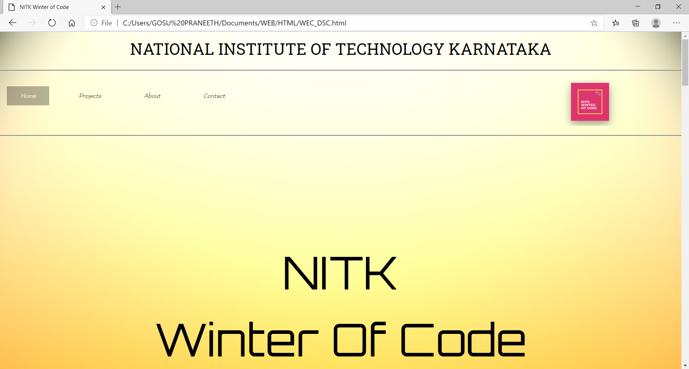
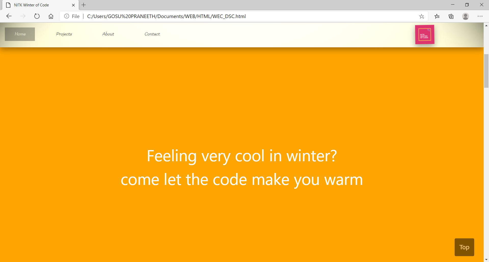
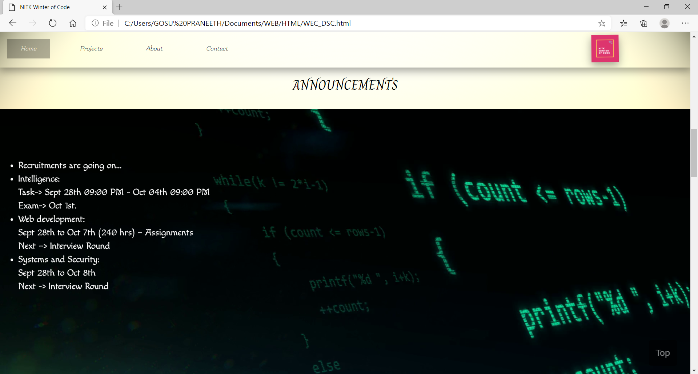
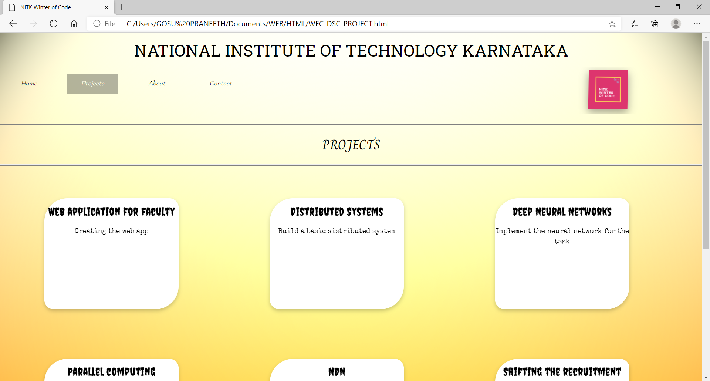

# WEC_DEC_WEB
I made the task Task ID: NITK_Winter_Of_Code_Homepage\
It contains the four webpages named:Home,Projects,About,Contact.\
The necessary files, photos all are uploaded into github.\
Few screenshots of the webpages are:\
\
\
\

These screen shots are included in the readme because if any problem happens in loading the photos these may helpful\
NOTE: These are only few screenshots not all.\
The information about the files included are \
* In HTML folder: WEC_DSC.html,WEC_DSC_PROJECT.html,WEC_DSC_ABOUT.html,WEC_DSC_CONTACT.html are included.\
* In CSS folder: TIME_LINE.css,WEC_DSC.css are included.\
* In JAVASCRIPT folder: WEC_DSC.js,carousel.js,counter.js are included.\
* In PHOTOS folder : Many photos necessary are included.\

Different fonts are used in the project they are included from the googlefonts.com\
Some useful animations and effects are applied by learning from w3schools.com\
Name:G.PRANEETH\
Reg.no:191IT117\
